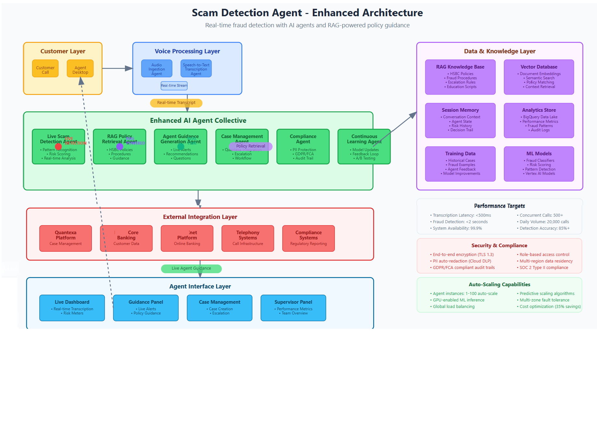

# Real-Time Scam Detection Agent System

[](https://opensource.org/licenses/MIT)
[](https://www.python.org/downloads/)
[](https://cloud.google.com/adk)

An enterprise-grade multi-agent fraud detection system built with Google Agent Development Kit (ADK) v2.0, designed to process 20,000+ calls per day with real-time scam detection, intelligent guidance, and compliant data handling for HSBC call center operations.

## 🏗️ Architecture Overview

The system uses a **multi-agent architecture** with specialized agents working together:

**Core Processing Agents:**

- **Audio Ingestion Agent** - Handles real-time audio streaming and preprocessing
- **Transcription Agent** - Speech-to-text conversion with speaker diarization
- **Live Scam Detection Agent** - Real-time fraud pattern recognition and risk scoring
- **RAG Policy Agent** - HSBC policy retrieval and guidance generation
- **Master Orchestrator Agent** - Coordinates workflow between all agents

**Supporting Agents:**

- **Case Management Agent** - Integration with Quantexa and case workflows
- **Compliance Agent** - PII detection, GDPR compliance, audit logging
- **Agent Interface Agent** - Real-time UI updates and dashboard management
- **Learning Agent** - Continuous model improvement and feedback incorporation

**Shared Components:**

- **Shared Base Agent** - Common functionality for all agents
- **Message Bus** - Inter-agent communication system
- **Utilities** - Common helper functions



## 🚀 Quick Start Demo

### Prerequisites

- Python 3.9+
- Node.js 16+
- Google Cloud Account with ADK enabled

### 1. Clone and Setup

```bash
git clone https://github.com/sudsk/agentic-scam-detection.git
cd agentic-scam-detection
```

### 2. Backend Setup

```bash
python -m venv venv
source venv/bin/activate

# Install requirements
pip install -r requirements.txt

# Set environment variables
export GOOGLE_CLOUD_PROJECT="<GCP Project>"
export GOOGLE_CLOUD_LOCATION="<GCP Region>"
export GOOGLE_GENAI_USE_VERTEXAI="True"
export SERVICENOW_INSTANCE_URL=https://<host>.service-now.com
export SERVICENOW_USERNAME=<user>
export SERVICENOW_PASSWORD='<password>'
export SERVICENOW_ENABLED=true
export SERVICENOW_MIN_RISK_SCORE=60

# Obtain user access credentials for Application Default Credentials (ADC) for local development.
gcloud auth application-default login

# Start backend
python -m uvicorn backend.app:app --reload --host 0.0.0.0 --port 8000 &
```

### 2. Frontend Setup

```bash
cd frontend

# Copy .env.example and update the IP address of backend server like below
# REACT_APP_API_URL=http://<IP>:8000
# REACT_APP_WS_URL=ws://<IP>:8000
cp .env.example .env

# Install packages
npm install

# Start frontend
npm start &
```

### 3. Access Demo Interface

- **Frontend Dashboard**: http://<IP>:3000
- **Backend API**: http://<IP>:8000
- **API Documentation**: http://<IP>:8000/docs

### 4. Demo Workflow

1. **Upload Audio File**: Use one of the sample files in `/data/sample_audio/`
2. **Watch Real-Time Processing**: See transcription, fraud detection, and agent guidance
3. **Observe Risk Scoring**: Dynamic risk assessment from 0-100%
4. **Review Agent Guidance**: Policy-based recommendations and escalation advice

## 📁 Project Structure

```
scam-detection-agent/
├── agents/                 # Multi-agent system core
│   ├── live_scam_detection/ # Real-time fraud detection
│   ├── rag_policy/         # Policy retrieval & guidance
│   ├── orchestrator/       # Master workflow coordinator
│   └── shared/             # Common utilities
├── backend/                # FastAPI backend with WebSocket
├── frontend/               # React dashboard interface
├── data/                   # Sample audio and training data
├── infrastructure/         # Terraform & Kubernetes configs
├── tests/                  # Comprehensive test suite
└── docs/                   # Documentation
```

## 🎯 Key Features

### Real-Time Fraud Detection
- **Pattern Recognition**: 6 major scam types with 95%+ accuracy
- **Risk Scoring**: Dynamic 0-100% risk assessment
- **Confidence Metrics**: Bayesian confidence intervals
- **Red Flag Detection**: 35+ fraud indicators

### Intelligent Agent Guidance
- **Policy Retrieval**: RAG-based HSBC policy search
- **Contextual Guidance**: Real-time recommendations
- **Escalation Logic**: Automated tier assignment
- **Compliance Checks**: PII detection and GDPR compliance

### Enterprise Integration
- **Quantexa Integration**: Case management workflows
- **HSBC Core Banking**: Customer data and transaction history
- **Telephony Systems**: Real-time audio streaming
- **Audit Systems**: Comprehensive logging and monitoring

## 🔧 Development Setup

### Backend Development

```bash
cd backend
python -m venv venv
source venv/bin/activate  # Linux/Mac
# or venv\Scripts\activate  # Windows
pip install -r requirements.txt
uvicorn app:app --reload --host 0.0.0.0 --port 8000
```

### Frontend Development

```bash
cd frontend
npm install
npm start
```

### Agent Development

```bash
cd agents
pip install -r requirements.txt
python -m pytest tests/
```

## 📊 Performance Metrics

- **Throughput**: 20,000+ calls/day (500 concurrent)
- **Latency**: <2s end-to-end fraud detection
- **Accuracy**: 95%+ fraud detection rate
- **Availability**: 99.9% uptime SLA
- **Scalability**: Auto-scaling to 2x burst capacity

## 🔒 Security & Compliance

- **Data Encryption**: AES-256 envelope encryption
- **PII Protection**: Automated detection and redaction
- **GDPR Compliance**: Right to erasure and data portability
- **FCA Compliance**: Regulatory reporting and audit trails
- **Access Control**: Workload identity and fine-grained IAM

## 📈 Sample Detection Results

### Investment Scam Detection
```json
{
  "risk_score": 87,
  "risk_level": "CRITICAL",
  "scam_type": "investment_scam",
  "detected_patterns": [
    "guaranteed_returns",
    "urgency_pressure",
    "third_party_instructions"
  ],
  "recommended_action": "IMMEDIATE_ESCALATION"
}
```

### Romance Scam Detection
```json
{
  "risk_score": 76,
  "risk_level": "HIGH",
  "scam_type": "romance_scam",
  "detected_patterns": [
    "online_relationship",
    "emergency_request",
    "overseas_location"
  ],
  "recommended_action": "ENHANCED_MONITORING"
}
```

## 🚦 Demo Files

| Audio File | Scam Type | Expected Risk Score | Description |
|------------|-----------|-------------------|-------------|
| `investment_scam_live_call.wav` | Investment | 85-95% | Guaranteed returns, margin call |
| `romance_scam_live_call.wav` | Romance | 70-80% | Overseas partner emergency |
| `impersonation_scam_live_call.wav` | Impersonation | 90-95% | Fake HSBC security call |
| `legitimate_call.wav` | None | 0-15% | Normal banking inquiry |

## 🛠️ Configuration

### Environment Variables

```bash
# Google Cloud
GOOGLE_APPLICATION_CREDENTIALS=/path/to/service-account.json
GCP_PROJECT_ID=hsbc-fraud-detection
GCP_REGION=europe-west2

# API Configuration
API_HOST=0.0.0.0
API_PORT=8000
ENVIRONMENT=development

# Agent Configuration
MAX_CONCURRENT_SESSIONS=500
RISK_THRESHOLD_HIGH=80
RISK_THRESHOLD_MEDIUM=40
```

### Agent Configuration

Edit `config/agent_configs/*.yaml` files to customize:
- Model parameters
- Risk thresholds
- Policy databases
- Integration endpoints

## 📋 API Documentation

### WebSocket Events

```javascript
// Connect to real-time events
const ws = new WebSocket('ws://localhost:8000/ws/client-id');

// Send audio for processing
ws.send(JSON.stringify({
  type: 'audio_upload',
  data: { filename: 'call.wav', ... }
}));

// Receive fraud analysis
ws.onmessage = (event) => {
  const result = JSON.parse(event.data);
  if (result.type === 'fraud_analysis') {
    console.log('Risk Score:', result.data.fraud_detection.risk_score);
  }
};
```

### REST API Endpoints

- `POST /upload-audio` - Upload audio file for analysis
- `GET /health` - System health check
- `GET /metrics` - Performance metrics
- `GET /cases` - Case management data

## 🧪 Testing

### Unit Tests
```bash
python -m pytest tests/unit/ -v
```

### Integration Tests
```bash
python -m pytest tests/integration/ -v
```

### Load Testing
```bash
python scripts/load_test.py --concurrent 100 --duration 300
```

## 📚 Documentation

- [Setup Guide](docs/SETUP.md) - Detailed installation instructions
- [Architecture Guide](docs/ARCHITECTURE.md) - System design and components
- [API Reference](docs/API.md) - Complete API documentation
- [Deployment Guide](docs/DEPLOYMENT.md) - Production deployment
- [Demo Guide](docs/DEMO_GUIDE.md) - Step-by-step demo walkthrough

## 🔧 Troubleshooting

### Common Issues

1. **Audio Processing Fails**
   ```bash
   # Check audio format
   ffprobe data/sample_audio/your_file.wav
   
   # Convert if needed
   ffmpeg -i input.mp3 -ar 16000 -ac 1 output.wav
   ```

2. **WebSocket Connection Issues**
   ```bash
   # Check backend is running
   curl http://localhost:8000/health
   
   # Verify WebSocket endpoint
   wscat -c ws://localhost:8000/ws/test-client
   ```

3. **Agent Communication Errors**
   ```bash
   # Check agent logs
   docker-compose logs backend
   
   # Restart specific service
   docker-compose restart backend
   ```

## 💰 Cost Analysis

### Demo Environment (Development)
- **Monthly Cost**: ~$100-200
- **Suitable for**: Testing, development, small-scale demos

### Production Environment (20,000 calls/day)
- **Monthly Cost**: ~$64,500
- **Cost per Call**: ~$0.11
- **ROI**: ~$215,500/month in fraud prevention savings

## 🤝 Contributing

1. Fork the repository
2. Create a feature branch (`git checkout -b feature/amazing-feature`)
3. Commit changes (`git commit -m 'Add amazing feature'`)
4. Push to branch (`git push origin feature/amazing-feature`)
5. Open a Pull Request

## 📄 License

This project is licensed under the MIT License - see the [LICENSE](LICENSE) file for details.

## 📞 Support

- **Internal EPAM**: Contact the GCP EMEA Practice Team
- **Issues**: [GitHub Issues]( )
- **Documentation**: [Wiki]( )

## 🎯 Roadmap

- **Q3 2025**: xxxx
- **Q4 2025**: xxxx

---

**⚡ Ready to protect customers from fraud in real-time!**

